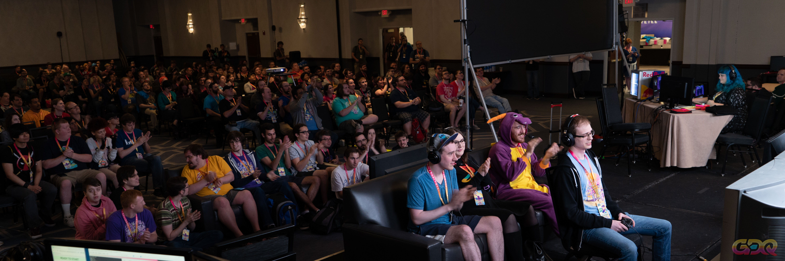

## About
2NT is an interactive game app, inspired by Games Done Quick, that revolves around speed and collaboration between different users.

#### Table of contents
1. [Concept](#concept)
2. [Storyboard and Interactions](#storyboard-and-interactions)  
* [About page](#about-page) 
* [Play](#play) 
* [Leaderboard](#leaderboard) 
* [Interactions](#interactions) 
3. [Key Features](#key-features)
4. [Team](#team)

## Concept

Games Done Quick is a series of charity video games marathons held twice a year. It features high level gamplay from speedrunners and has an attendance of average 2000 people. 2NT is inspired by and created for these events, the idea is to make the public run its own marathon during the breaks from the gameplays.
The concept of 2NT is easy, each user has to enter a room, the game will start when the room has reached the nember of 16 players in it. Then a stopwatch will start and each person just needs to touch one of the squares, once the grid is all complete the time will stop and the score will enter the leaderboard. 

## Storyboard and Interactions
The app is divided in three main parts: about, play and leaderboard. 

#### About page
In this section the user can have a general idea of what is Games Done Quick and what this game is all about.

