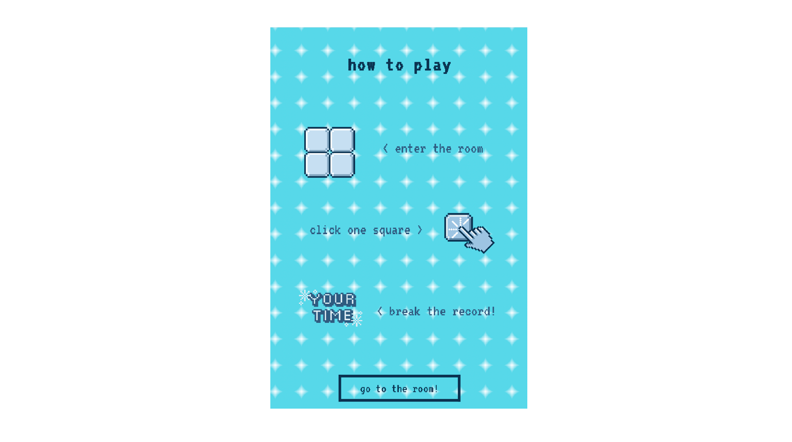
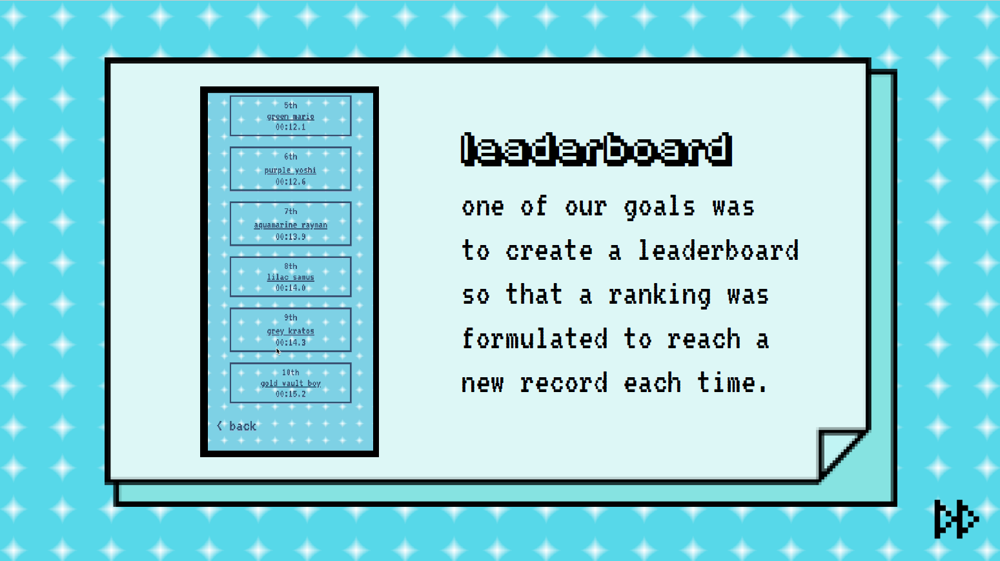

## About
2NT is an interactive game app, inspired by Games Done Quick, that revolves around speed and collaboration between different users.
It is built using p5.js, HTML and CSS languages and it was developed for the final exam of the course Creative Coding at Politecnico di Milano.

#### Table of contents
1. [Contest](#1.-contest)
2. [Structure of the game](#structure-of-the-game) <br>
a. [About page](#about-page)<br>
b. [Play](#play)<br>
c. [Leaderboard](#leaderboard)<br>
3. [Visual ID](#visual-id)<br>
4. [Code architecture](#code-architecture)
5. [Difficulties encountered](#difficulties-encountered)
6. [Future developments](#future-developments)
7. [Team](#team)

## Contest

2NT was designed for the event “Games Done Quick”.<br>
<br>
What is it? Games Done Quick is an event that includes a series of charity video games marathons held twice a year. It features high-level gameplay by speedrunners and has an attendance of average 2000 people.
The goal of this event is to play an entire game or only a part of it with the intention of completing it as fast as possible.<br>
<br>
For this occasion, 2NT was born: a game that reflects the main feature of GDQ events - completing the game as fast as possible!.<br>
<br>
The game is very simple and intuitive - the user has to click only a square as fast as he can to complete the mission. For this reason, 2NT has been designed to be played during Games Done Quick breaks so that between one game session and the other, players can entertain themselves with this fun mini speedrun.<br>
<br>
Briefly: each user has to enter a room and the game will start when the room has reached the number of 16 players in it. Then a stopwatch will start, and each person just needs to touch one of the squares, once the grid is all complete the time will stop, and the score will be registered in the leaderboard.<br>
<br>
2NT was designed primarily for users who participate in GDQ events, but it can be used by anyone and even by less experienced players as it is very simple to play with.


## Structure of the game
The app is divided in three main parts: "about", "play" and "leaderboard". There is also a link directing to GDQ website.


#### About page
In the "about" section the game is presented to the players in such a way that they have an idea what it is about.


#### Play
Here the user can play the game itself, the first page is an introduction to the game taht shows the instructions of how it works.

Clicking a button the player can enter the room he will be playing in and he has to wait for the other players to join.
When the number of players is reached, the first tap on one of the squares gets the time started and then all the players just have to tap to complete the game. For each players it's possible just to tap once.

 <br>

When the grid is complete the time will stop and the score will be added to the leaderboard.


#### Leaderboard
In this section the users can see the scores of all the different runs, every room has a name assigned randomly that helps players identify which score his theirs.<br>
<br>
Unfortunately we were unable to complete this section which is not functional [:(], but we have only created a mockup of it which can be found in the app.<br>
<br>
The names of the rooms are generated using two arrays containing a long list of videogame characters and a list of colors in order to have a large number of possible combinations for the room names.


## Visual ID
We wanted to make the graphics of our game similar to that of most of the videogames featured in GDQ runs so we chose to work with an 8-bit aesthetic.<br>
<br>
For this reason we thought of iconic pixelated graphic elements designed or customized by ourselves.<br>
<br>
For choosing the color palette we opted for a blue scale to resemble the aesthetic of the original logo of the event.<br>
<br>
The fonts we chose, VT323 and Fipps, are essential for entering the vintage and nichey mood of the game.


## Code Architecture
2NT has been developed for mobile devices so the user interacts with the interface by tapping and scrolling (where it is allowed) on the screen.<br>
<br>
Now we will present some of the most interesting features of the code.<br>

### Server.js
##### Data emission & reception


```var count = 0;
var $ipsConnected = [];

function newConnection(socket){

	var $ipAddress = socket.handshake.address;
	if (!$ipsConnected.hasOwnProperty($ipAddress)) {
		$ipsConnected[$ipAddress] = 1;
		count++;
		socket.emit('counter', {count:count});
	}

	//when a new connection is created, print its id
	console.log('socket:', socket.id);

	//define what to do on different kind of messages
	socket.on('mouse', mouseMessage);

	function mouseMessage(data){
		socket.broadcast.emit('mouseBroadcast', data);
		console.log(data);
	}
  ```

  ```
  function newDisconnect(socket){

    	if ($ipsConnected.hasOwnProperty($ipAddress)) {

    		delete $ipsConnected[$ipAddress];
  	    count--;
  	    socket.emit('counter', {count:count});

    	}
  }
  ```


### Play.js
##### Grid construction
The base of our game is a grid made of sixteen squares. Inside the preload function occurs the construction of the array concerning the values' control. As a starting point, we decided to state a value marked = 0.
Then a grid is constructed, according to the canvas' dimensions, in order to obtain perfectly equal square spaces.


```
function setup() {
  strokeWeight(4);
  let cnv = createCanvas(640, 640);
  cnv.position((windowWidth / 2) - 320, (windowHeight / 2) - 320);

xSize = 640 / rows;
ySize = 640 / columns;

stroke(51, 73, 108, 120);
strokeWeight(4);
noFill();

//-------initialize the array, check that every value is marked "0"
for (var i = 0; i < grid.length; i++) {
  grid[i] = new Array(columns);
  for (var k = 0; k < grid.length; k++) {
    grid[i][k] = 0;
  }
}

//-------square grid
for (var i = 0; i < rows; i++) {
  for (var y = 0; y < columns; y++) {

    rect(i * xSize, y * ySize, xSize, ySize);
  }
 }
}
```

##### Counting people entering the room
This passage is divided in two steps, the first one concerns the creation of an id called "guests" written in the index (play.html), where the paragraph of the counter itself it's created.

```
<body>
  <p id="toptext"> The run starts with 16 players<br>you are now</p>
  <p id="guests"> </p>
</body>
```
    The second part of the command, the one that triggers the event, is created by calling a function and verify the number of people, by doing so the number of connections could be monitored. The desired number in this game is sixteen, corresponding to sixteen users. The number is retrieved from the "guests" paragraph.

```//-------count connections number
function handleCounter(data) {
  document.getElementById("guests").innerHTML = data.count;
  console.log('received:', data);
  //test to verify number of connections
  if (data.count == 16) {
     //
  }
}
  ```
##### Interact with the canvas
The action taken by each user is described in the mouseClicked{} function.
The data emitted by users are the "tap" positions on the canvas. When an interaction with the grid occurs, the fillRectangle{} (associated with the position's data) function is implemented. We used the parseInt() to obtain a positive integer.

  ```function mouseClicked() {
    //-------create an object containing the mouse position
    var data = {
      x: mouseX,
      y: mouseY
    }

    var axis = parseInt(mouseX / xSize);
    var ordinates = parseInt(mouseY / ySize);

    socket.emit('mouse', data);
    console.log('sending: ', mouseX, mouseY);
    fillRectangle(mouseX, mouseY);
    executed++;
  }
    ```
The interaction is limited to one tap for every single user in order to make the game collaborative.
In this way the grid could not be completed by one user only, but each person needs the help of others to win.
(Conditional written in mouseClicked(){} function).

  ```//-------only one click
    if (executed >= clickLimit) {
      //alert("Only one!");
      return;
    }
  ```
  To avoid click repetition on the same square, a limitation has been inserted.
  In this way the user could only makes a single square appear, without an interaction with squares that have been already generated.
  (Conditional written in mouseClicked(){} function).

  ```if (grid[axis][ordinates] == 1) {
    //alert("Already Clicked!");
    return;
  }
  ```
  The reception of data sent by other users is implemented through the function newClick(){}.

  ```
  function newClick(data) {

    console.log('received:', data);
    fillRectangle(data.x, data.y);

  }
  ```

##### Square creation
Through the interaction appears a darker square with an icon at the center, randomly picked from the images' array.
The four sides of the square perfectly follow the limits of the grid's space, because the same spatial variable are used.
The filling of the entire grid is stated by a function called checkCompletition(){}, directly linked with the grid's coordinates.

  ```//-------fill a square according to emitted data
  function fillRectangle(x, y) {

    //-------coloring the rectangle
    fill(51, 73, 108, 120);
    stroke(255);

    var axis = parseInt(x / xSize);
    var ordinates = parseInt(y / ySize);

    rect(axis * xSize, ordinates * ySize, xSize, ySize);
    imageMode(CENTER);
    image(imageArray[Math.floor(random(imageArray.length))], axis * xSize + xSize / 2, ordinates * ySize + ySize / 2, xSize / 2, ySize / 2);

    checkCompletition(axis, ordinates);

    }
  }
  ````

##### Starting the timer
The timer starts when the first person taps the canvas, in this way the game has begun!.
The #timer paragraph is created in the index.

        ```#timer {
              text-align: center;
              font-size: 180px;
              margin-bottom: 5px;
              margin-top: 30px;
              margin-right: auto;
              margin-left: auto;
              font-family: "VT323";
              color: #415b7e;

            }
          <body>
            <p id="timer" style="display: none"></p>
          </body>
        ```
The timer itself is called by creating a function that defines which units to show (seconds and tenths of seconds) and then set the conditions for which the timer starts. On the screen the HTML content of #timer is shown.(Function contained in fillRectangle(){} function).

          ```
          function timeIt() {
           decseconds++;
            if (decseconds >= 9) {
              decseconds -= 9;
              seconds++;
            }
            if (seconds >= 60){
              seconds -= 60;
              minutes++;
            }

        	document.getElementById("timer").innerHTML = minutes + ":" + seconds + "." + decseconds;
          }
          ```
We used setInterval() to call a function periodically, based on a specified time interval.
(Conditional written in fillRectangle(){} function).

          ```
          //-------first iteration, time starts
        	if(showTime == 0){
        		showTime = 1;
        		timeVar = setInterval(timeIt, 100);
        		document.getElementById("timer").style.display = "block";
        	}
          ```
##### Check Completion
The grid that was previously used to check marks = 0 is the same constructed in this function to check that every values are marked "1". If every value results "1", then the grid is completed and a " YAY!" message will appear.
The timer stops and shows how long did it take to fill all the squares. We used clearInterval to reset the timer created with setInterval().

A random combination of elements picked from the two arrays(var roomNames + var roomColors) generates a room nickname associated with game time. (Only visible in console.log, for now...).

          ```
          //-------check that all values are marked "1"
          function checkCompletition(x, y) {

            grid[x][y] = 1;

            for (var i = 0; i < grid.length; i++) {
              for (var y = 0; y < grid[i].length; y++) {
                if (grid[i][y] == 0) {
                  return;
                }
              }
            }
            //-------time stops
            clearInterval(timeVar);
            imageMode(CENTER);
            fill(51, 73, 108, 120);
            rect(0, 0,  640, 640);
            //alert("YAY!");
            image(yay, width / 2, height / 2, yay.width / 5, yay.height / 5);
            //-------console log with time + random room
            console.log(roomColors[Math.floor(random(roomColors.length))] + " " + roomNames[Math.floor(random(roomNames.length))] + " : " + timer.innerHTML);
          }
          ```

##### Fix the screen
Avoid the screen sliding and page refresh in some devices.

          ```
          //-------fixed screen when you touch it
          function touchMoved() {
            return false;
          }
          ```

## Difficulties encountered


## Future developments




## Team
*2NT* was developed by:


