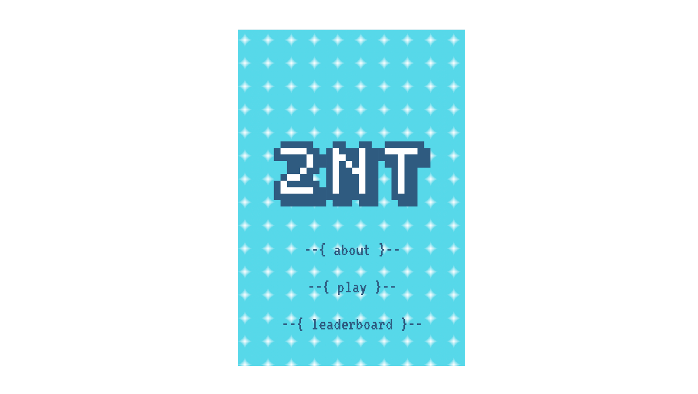
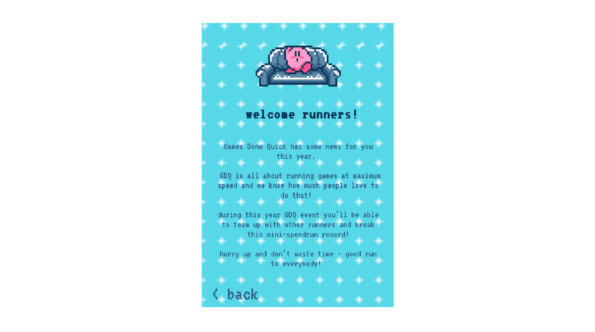
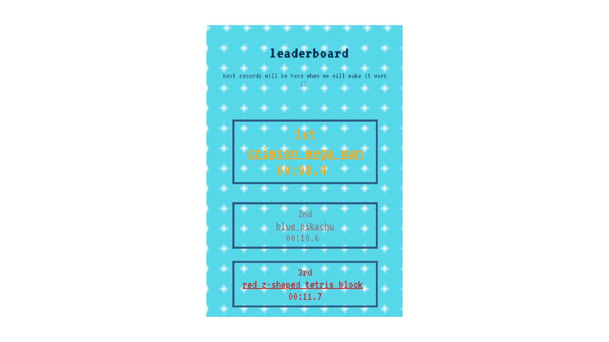
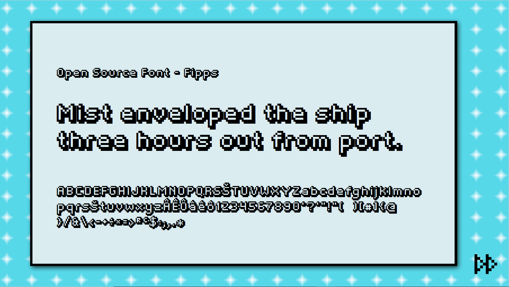

## About
2NT is an interactive game app, inspired by Games Done Quick, that revolves around speed and collaboration between different users. 
It is built using the language p5.js and was developed for the final exam of the course Creative Coding at Politecnico di Milano. 

#### Table of contents
1. [Contest](#1.-contest)
2. [Structure of the game](#2.structure-of-the-game) <br>
a. [About page](#about-page)<br>
b. [Play](#play)<br>
c. [Leaderboard](#leaderboard)<br>
3. [Visual ID](#visual-id)<br>
4. [Code architecture](#code-architecture)
5. [Difficulties encountered](#difficulties-encountered)
6. [Team](#team)

## 1. Contest

2nt was designed for the event “Games Done Quick”. What is it? Games Done Quick is an event that includes a series of charity video games marathons held twice a year. It features high-level gameplay by speedrunners and has an attendance of average 2000 people. 
The goal of this event is to play an entire game or only a part of it with the intention of completing it as fast as possible.<br>
For this occasion, 2nt was born: a game with the aim of achieving its goal by reaching a new record each time.<br>
The game is very simple and intuitive: in fact, the user has to click only a square as fast as he can to complete the mission. For this reason, 2nt has been designed to be played during the event Games Done Quick: so that between one game session and the other, players can entertain themselves with this fun mini speedrun.
Briefly: each user has to enter a room the game will start when the room has reached the number of 16 players in it. Then a stopwatch will start, and each person just needs to touch one of the squares, once the grid is all complete the time will stop, and the score will enter the leader board.<br>
2NT was designed primarily for users who participate in GAMES DONE QUICK events, but it can be used by anyone even by less experienced players as it is very simple to play with. 


## 2. Structure of the game
The app is divided in three main parts: about, play and leaderboard. 


#### a. About page
In the about section the game is generally presented to the players in such a way that they have an idea what it is about. 


#### b. Play
Here the user can play the game itself, the first page is an introduction to the game, giving the instructions of how it works.

Clicking a button the player can enter the room he will be playing in and he has to wait for other players to join. 
When the number of players is reached, the first tap on one of the squares gets the time started and then all the players just have to tap to complete the game. For each players it's possible just one tap.

When the grid is complete the time will stop and the score will be added to the leaderboard.


#### c. Leaderboard
In this section the users can see the scores of all the different runs, every room has a name assigned randomly that helps players identify which score his theirs.<br>
Unfortunately we were unable to complete this section which is not functional, but we have only created a mockup of it which can be found in the app. 



## 3. Visual ID
We wanted to make the graphics of our game similar to that of most of the Games Done Quick videogames, that is 8-bit graphics. For this reason we thought of pixelated graphic elements designed by ourselves.<br> For the choice of colors we opted for a blue scale.<br> Fonts, on the other hand, are essential for entering the vintage mood of the game.




## 4. Code Architecture
2NT is created for mobile devices, the user interacts with the game by tapping on the screen. 
Now we present some of the most interesting features of the code.
##### Counting people entering the rooms
This id divided in two steps, the first part is written in the index, where the paragraph of the counter itself it's created.
```
<body>

  <p id="toptext"> The run starts with 16 players<br>you are now</p>

  <p id="guests"> </p>

  <p id="timer" style="display: none"></p>

</body>
```
The second part of the command, the one that triggers the event, is created by calling a function and verify the number of people until they reach 16.
```
function handleCounter(data) {

  document.getElementById("guests").innerHTML = data.count;
  console.log('received:', data);
  //prova per verificare il numero di persone!!
  if (data.count == 16) {
    //console log prova!
    //console.log(roomColors[Math.floor(random(roomColors.length))] + " " + roomNames[Math.floor(random(roomNames.length))] + " : " + timer.innerHTML);
  }
  }
  ```
  
##### Starting the timer
The timer starts when the room is full and the first person taps on one of the squares.
The paragraph is created in the index.
```
#timer {
      text-align: center;
      font-size: 180px;
      margin-bottom: 5px;
      margin-top: 30px;
      margin-right: auto;
      margin-left: auto;
      font-family: "VT323";
      color: #415b7e;

    }
```
The timer itself is called by creating a function that defines which units to show (seconds and tenths of seconds) and then set the conditions for which the timer starts. 
  ```
  function timeIt() {
   decseconds++;
    if (decseconds >= 9) {
      decseconds -= 9;
      seconds++;
    }
    if (seconds >= 60){
      seconds -= 60;
      minutes++;
    }

	//time ++;
	document.getElementById("timer").innerHTML = minutes + ":" + seconds + "." + decseconds;
  }

	//first iteration
	if(showTime == 0){
		showTime = 1;
		myVar = setInterval(timeIt, 100);
		document.getElementById("timer").style.display = "block";
	}
  ```
##### Tapping just one square per user
One interesting feature is the limit on the number of sqaures that one user can tap.
In order to make the game collaborative, we set the limit of just one click per person, with this the game can not be completed by one user only but each person needs the help of others to win.
```
unction mouseClicked() {
  //-------create an object containing the mouse position
  var data = {
    x: mouseX,
    y: mouseY
  }

  //-------only one click
  if (executed >= clickLimit) {
    //alert("Only one!");
    return;
  }

  var ascisse = parseInt(mouseX / xSize);
  var ordinate = parseInt(mouseY / ySize);

  if (grid[ascisse][ordinate] == 1) {
    //alert("Already Clicked!");
    return;
  }
```


## 5. Difficulties encountered


## 6. Team
*2NT* was developed by:
+ Elisabetta D'Orto
+ Lorenzo Di Grazia
+ Erica Tronconi
+ Isabella Possaghi


